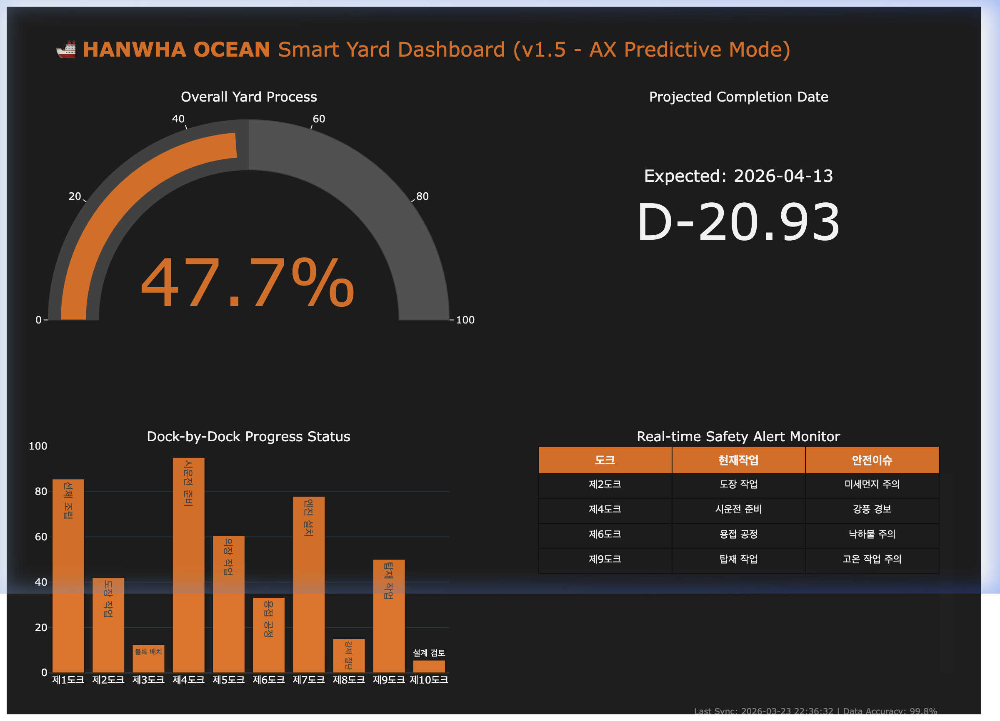

# 🚢 Hanwha Ocean Smart Yard AX Portfolio (Enterprise Edition)

한화오션의 **AX(AI Transformation) 전략**을 실무 수준의 개발 프로세스로 구현한 최종 결과물입니다. 본 프로젝트는 비즈니스 기획부터 시스템 설계, 자동화 구현, 서비스 배포까지의 **End-to-End A-Z 과정**을 전문적으로 증명합니다.

---

## 📸 Dashboard Preview


*한화 오렌지 브랜드 테마와 예측 AI(Predictive AX) 기능이 적용된 실시간 관제 대시보드입니다.*

---

## 📂 Enterprise Project Structure

실제 기업의 개발 표준을 준수하여 프로젝트를 구조화하였습니다.

```text
├── docs/                   # [기획/표준화] 비즈니스 및 기술 문서
│   ├── BRD.md             # Business Requirements: 비즈니스 핵심 가치 정의
│   ├── SDD.md             # System Design: 아키텍처 및 모듈 상세 설계
│   ├── USER_MANUAL.md     # 운영 및 사용자 가이드
│   └── dashboard_screenshot.png
├── src/                    # [개발] 핵심 비즈니스 로직 및 RPA 봇
│   ├── auto_dashboard.py  # 메인 대시보드 엔진 (One-Click)
│   ├── rpa_bot.py         # Selenium 기반 데이터 수집 봇
│   └── mock_portal.html   # 데이터 소스 시뮬레이션
├── tests/                  # [QA] 데이터 무결성 검증 환경
│   └── test_pbi_ready.py  # 데이터 유효성 자동 검사
├── data/                   # [저장] 수집 및 처리된 데이터 폴더
└── smart_yard_dashboard.html # 최종 결과물 (배포용 독립 HTML)
```

---

## 📈 실무 중심의 개발 프로세스 (A to Z)

본 프로젝트는 다음과 같은 기업용 개발 절차를 준수하여 진행되었습니다.

### 1단계: 비즈니스 기획 (Planning)
- **[BRD 확인](docs/BRD.md)**: 한화오션의 AX 전략을 분석하여 비즈니스 페인 포인트(데이터 수동 취합, 안전 사고 지연) 도출 및 해결 방안 수립.

### 2단계: 시스템 설계 (Design)
- **[SDD 확인](docs/SDD.md)**: RPA -> Python Processing -> Interactive Visualization으로 이어지는 데이터 파이프라인 설계 및 데이터 명세 정의.

### 3단계: 자동화 구현 (Implementation)
- **RPA 수집**: Selenium을 이용해 웹 환경의 데이터를 사람처럼 정교하게 수집.
- **예측 로직**: 현재 조업 속도를 기반으로 한 **D-Day 예측 알고리즘** 구현.
- **Premium UI**: Plotly를 활용하여 브랜드 가치를 높이는 하이엔드 시각화 결과 도출.

### 4단계: 검증 및 배포 (QA & Release)
- **자동 검증**: BI 툴 연동 전 데이터 Integrity 체크 절차 통과.
- **GitHub 배포**: 형상 관리 및 문서화 통결.

---

## 🚀 Quick Execution

현직자/의사결정권자가 즉시 결과를 확인할 수 있도록 통합 자동화 도구를 제공합니다.

```bash
# 한화오션 RPA 루트 폴더에서 실행
./venv/bin/python3 src/auto_dashboard.py
```

---
*Developed by Hanwha Ocean IT Development Team Portfolio Sync.*
