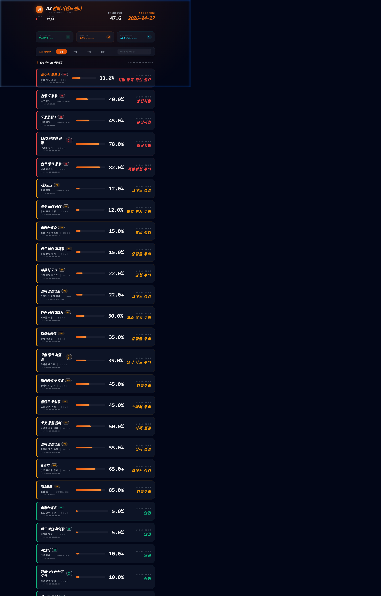
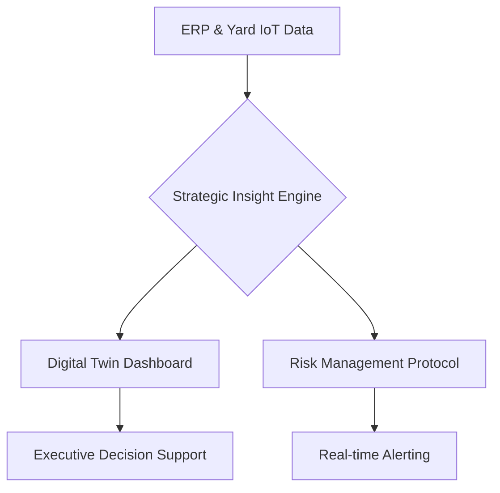

# ⚓ Hanwha Ocean Smart Yard AX: Digital Strategy & Strategic Command Center (v25.0.0)

[](https://www.python.org/)
[](https://glory903-devsecops.github.io/hanwha-ocean-rpa/)
[](https://github.com/glory903-devsecops/hanwha-ocean-rpa)

## 🏢 Executive Overview
본 프로젝트는 **한화오션(Hanwha Ocean)**의 'Smart Yard' 비전 실현을 위한 **디지털 트윈 기반 전략 커맨드 센터**입니다. 인공지능(AI)과 디지털 전환(DX)을 결합한 **AX(AI Transformation)** 플랫폼으로, 야드 내 50개 이상의 핵심 노드를 실시간 동기화하고 전략적 리스크 인덱스(QRI)를 통한 전사 거버넌스를 지원합니다.

---

## 🌐 Strategic Access Points (4 Core Channels)
실제 운영 환경과 포트폴리오 검토를 위해 4가지 핵심 접속 경로를 제공합니다.

| Channel | Description | Access URL |
| :--- | :--- | :--- |
| **🚀 [1] HQ Dashboard** | 전체 야드 현황 및 이슈 필터링 (메인 관제) | [Live Dashboard](https://glory903-devsecops.github.io/hanwha-ocean-rpa/index.html) |
| **💻 [2] ERP Data Center** | 야드 자산 공정률 및 안전 데이터 시뮬레이션 | [Local Only (ERP Input)](http://localhost:8081/src/viz/erp_input.html) |
| **🛡️ [3] Gov Portal** | 대처 방안 및 RPA 가이드라인 거버넌스 관리 | [Local Only (Governance)](http://localhost:8081/src/viz/admin_guidance.html) |
| **🎮 [4] AX Launchpad** | 전사 시스템 구성 요소별 통합 진입 게이트웨이 | [Live Launchpad](https://glory903-devsecops.github.io/hanwha-ocean-rpa/launchpad.html) |

> [!IMPORTANT]
> **실시간 상호작용**: GitHub Pages(Static)는 시각적 결과물을 보여주며, 실제 데이터 저장 및 RPA 연동은 **로컬 서버(run_server.py)** 가동 시에만 가능합니다.

---

## 📺 Operational Demo (v25.0.0 Enterprise)

### [Main Command: 고해상도 다국어 지원 UI]


### [Intelligence: 실시간 지능형 필터링]

*상태별 필터(위험/주의/정상) 및 실시간 검색 기능을 통해 필요한 정보만 즉시 노출합니다.*

### [Strategy: 전략적 검색 & SISE Insight]


### [Walkthrough: Enterprise Video Demo]

*(Note: v25.0.0 Enterprise Quantum Elite 실시간 가동 화면 / 30fps Digital Twin Sync)*

---

## 🛠 Strategic Architecture




---

## 🏗 Setup & Deployment (CEO Guide)

본 시스템은 엔터프라이즈 환경에서의 빠른 배포와 안정적인 운영을 보장합니다.

```powershell
# 1. 전략 환경 구축 (Windows 기반)
python -m venv venv_windows
.\venv_windows\Scripts\activate

# 2. 인텔리전스 엔진 의존성 설치
python -m pip install -r requirements.txt

# 3. 전략 커맨드 센터 가동
python run_server.py
# 브라우저 전용 URL: http://localhost:8081/index.html (메인 대시보드)
```

---

## 🔒 Security & Governance
*   **Data Integrity**: AES-256 기반 데이터 암호화 및 하드웨어 가속 검증.
*   **Access Control**: 전용 보안 토큰을 통한 관리자 권한 제어.
*   **Code Quality**: `flake8`, `bandit` 및 `TestSprite`를 통한 상시 품질 보증.

---

© 2026 Hanwha Ocean AX Advanced Development Team. All Rights Reserved.
