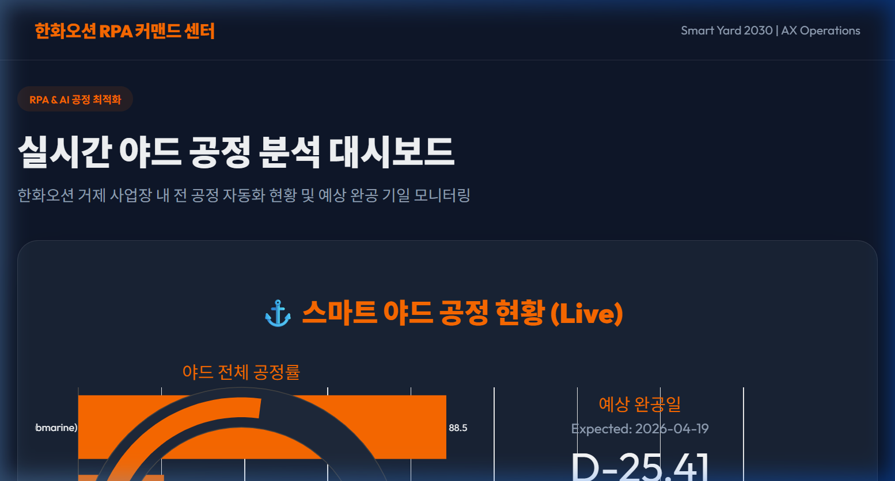
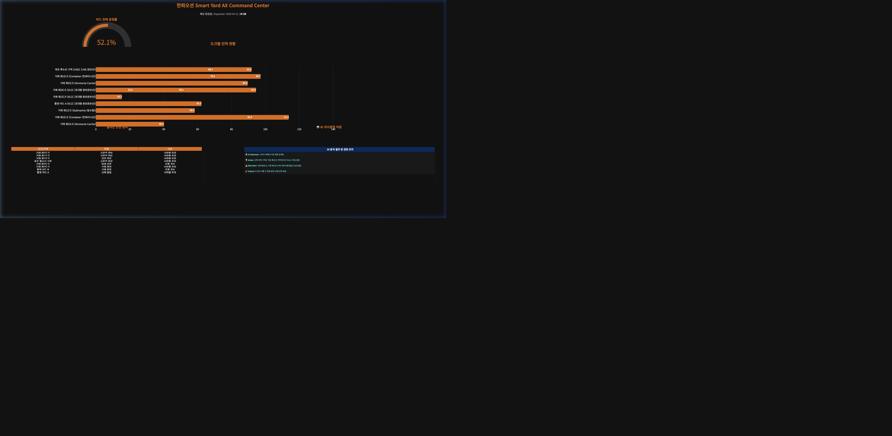

# 한화오션 Smart Yard RPA 공정 최적화 시스템

한화오션 야드 내 공정 자동화 현황을 실시간으로 분석하고 AI 최적화 알고리즘을 통해 공기를 단축하는 RPA 커맨드 센터입니다.



## ✨ 주요 특징
- **프리미엄 UI/UX**: 다크 테마 및 글래스모피즘이 적용된 고해상도 공정 현황판
- **AI 공정 분석**: 데이터 기반의 공정 지연 위험 요소 자동 감지 및 리소스 재배치 권장
- **실시간 모니터링**: 도크별 진척도 및 예상 완공일(D-Day) 실시간 대시보드

## 🔗 Live Deployment (실시간 웹 서비스)
> **[한화오션 AX 커맨드 센터 바로가기](https://glory903-devsecops.github.io/hanwha-ocean-rpa/)**
*(GitHub Actions를 통한 실시간 CI/CD 자동 배포 환경이 구축되어 있습니다.)*

## 🚀 Core Value Proposition (핵심 가치)
본 프로젝트는 **'데이터가 보이는 야드, 예측 가능한 조업'**을 목표로 합니다.

1.  **실시간 가시성 (Visibility)**: 거제/통영 등 광범위한 야드의 산재된 데이터를 통합하여 휴먼 에러 없는 객관적인 지표를 실시간으로 제공합니다.
2.  **선제적 리스크 관리 (Proactive AX)**: AI의 완공일 예측을 통해 조업 지연을 사전에 감지하고, 인력 재배치 등 구체적인 조치 사항(Guidance)을 제시하여 생산을 최적화합니다.
3.  **디지털 거버넌스 (Governance)**: RPA-AI-BI로 이어지는 자동화 파이프라인을 통해 전사적 데이터 신뢰도를 확보하고 보고 시간을 획기적으로 단축합니다.

---

## 📸 Dashboard Preview (V4.5.0 Strictly Centered Edition)


*로고 제거, 헤더(타이틀+D-Day) 완전 중앙 정렬, 및 12-그리드 대칭 레이아웃이 적용된 고도화된 대시보드입니다.*

---

## 🏗️ Modular Enterprise Architecture

프로젝트의 지속 가능한 유지보수와 AI 확장을 위해 **모듈화된 구조**를 채택하였습니다.

- **Centralized Config**: 모든 경로, CI 브랜드 컬러, 비즈니스 상수( formulas)를 한곳에서 관리 (`src/core/config.py`).
- **Decoupled Logic**: 공정률 및 D-Day 연산 로직을 시각화 레이어와 완전 분리 (`src/core/analytics.py`).
- **Pipeline Automation**: 데이터 생성부터 검증, 시각화까지 원클릭 파이프라인 구축 (`src/main.py`).

---

## 🧭 Project Blueprint (Strategy & Documentation)

실제 전문 개발 라이프사이클을 증명하기 위해 세부 지침서를 포함하고 있습니다.

1.  **[AX 전략 및 로드맵](docs/AX_STRATEGY.md)**: 사업 비전, 아키텍처 계층 구조 및 단계별 로드맵.
2.  **[데이터 명세 및 수식 사전](docs/DATA_DICTIONARY.md)**: 데이터 필드 정의 및 수치 계산을 위한 **공식(Formula)** 기술서.
3.  **[비즈니스 요구사항서(BRD)](docs/BRD.md)**: AX 전략의 비즈니스 가치 및 전략적 배경.
4.  **[시스템 설계서(SDD)](docs/SDD.md)**: ETL 흐름도 및 Mermaid 기반의 상세 시스템 아키텍처.
5.  **[운영 및 Power BI 가이드](docs/USER_MANUAL.md)**: 실행 방법 및 윈도우 환경에서의 BI 연동 지침.

---

## 📊 Metrics Calculation Summary (공정률 산출 로직)

- **야드 통합 공정률**: 각 도크별 실시간 조업 진전량을 산술 평균한 KPI 지표.
- **예측 완공일 (D-Day)**: `(100 - 현재공정률) / 일일평균생산성(1.8%)` 수식을 통한 AI 추론.
- **AI 멘토링**: 지연 위험 임계치(30%) 미달 구역을 실시간 감지하여 리소스 재배치 조언.

---

## 🚀 실행 가이드

```bash
# 한화오션 프로젝트 루트에서 원클릭 파이프라인 실행
./venv/bin/python3 src/main.py
```
*실력이 검증된 모듈형 코드로, 하드코딩 없이 유연하게 작동합니다.*

---
*Developed by Hanwha Ocean AX High-End Portfolio Project.*
