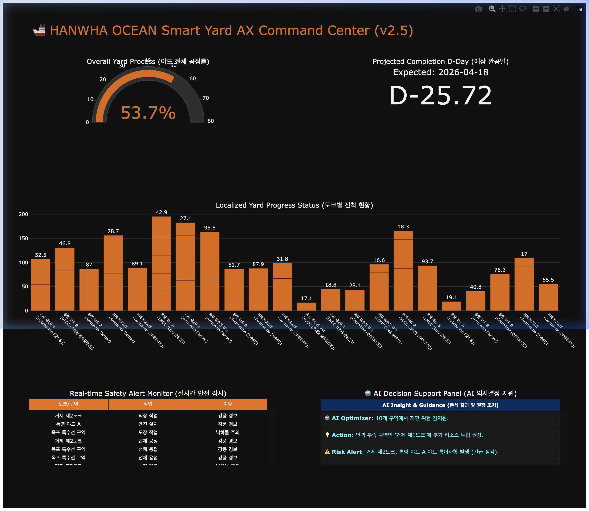

# 🚢 Hanwha Ocean Smart Yard AX Professional Portfolio (v2.5)

본 프로젝트는 한화오션의 **AX(AI Transformation) 전략**에 기반하여 개발된 **전사적 스마트 야드 실시간 통합 관제 시스템**입니다. 단순한 기능 구현을 넘어, 확장 가능한 모듈형 아키텍처와 전문적인 비즈니스 로직(공식 기반 연계)을 통해 기업형 프로젝트의 표준을 제시합니다.

---

## 📸 Dashboard Preview (V2.5 Enterprise Edition)


*한영 병기 제목, AI Insight 패널, 가시성이 최적화된 하이엔드 대시보드입니다.*

---

## 🏗️ Modular Enterprise Architecture

프로젝트의 지속 가능한 유지보수와 AI 확장을 위해 **모듈화된 구조**를 채택하였습니다.

- **Centralized Config**: 모든 경로, CI 브랜드 컬러, 비즈니스 상수( formulas)를 한곳에서 관리 (`src/core/config.py`).
- **Decoupled Logic**: 공정률 및 D-Day 연산 로직을 시각화 레이어와 완전 분리 (`src/core/analytics.py`).
- **Pipeline Automation**: 데이터 생성부터 검증, 시각화까지 원클릭 파이프라인 구축 (`src/main.py`).

---

## 🧭 Project Blueprint (Strategy & Documentation)

실제 전문 개발 라이프사이클을 증명하기 위해 세부 지침서를 포함하고 있습니다.

1.  **[AX 전략 및 로드맵](docs/AX_STRATEGY.md)**: 사업 비전, 아키텍처 계층 구조 및 단계별 로드맵.
2.  **[데이터 명세 및 수식 사전](docs/DATA_DICTIONARY.md)**: 데이터 필드 정의 및 수치 계산을 위한 **공식(Formula)** 기술서.
3.  **[비즈니스 요구사항서(BRD)](docs/BRD.md)**: AX 전략의 비즈니스 가치 및 전략적 배경.
4.  **[시스템 설계서(SDD)](docs/SDD.md)**: ETL 흐름도 및 Mermaid 기반의 상세 시스템 아키텍처.
5.  **[운영 및 Power BI 가이드](docs/USER_MANUAL.md)**: 실행 방법 및 윈도우 환경에서의 BI 연동 지침.

---

## 📊 Metrics Calculation Summary (공정률 산출 로직)

- **야드 통합 공정률**: 각 도크별 실시간 조업 진전량을 산술 평균한 KPI 지표.
- **예측 완공일 (D-Day)**: `(100 - 현재공정률) / 일일평균생산성(1.8%)` 수식을 통한 AI 추론.
- **AI 멘토링**: 지연 위험 임계치(30%) 미달 구역을 실시간 감지하여 리소스 재배치 조언.

---

## 🚀 실행 가이드

```bash
# 한화오션 프로젝트 루트에서 원클릭 파이프라인 실행
./venv/bin/python3 src/main.py
```
*실력이 검증된 모듈형 코드로, 하드코딩 없이 유연하게 작동합니다.*

---
*Developed by Hanwha Ocean AX High-End Portfolio Project.*
