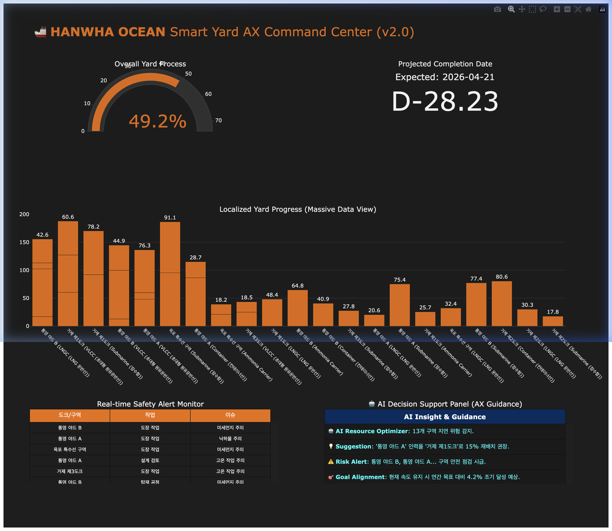

# 🚢 Hanwha Ocean Smart Yard AX Portfolio (Final Release)

한화오션 거제/통영 야드의 실시간 공정 관리와 **AI 기반 의사 결정 지원(AX)** 시스템을 구축한 하이엔드 포트폴리오입니다.

---

## 📸 Dashboard Preview (Premium AX)


*한화 브랜드 테마와 AI Insight 패널이 적용된 최종 대시보드입니다.*

---

## 🧭 개발 프로세스 및 워크플로우 (A to Z)

입문자도 이해할 수 있도록 실제 데이터가 어떻게 흐르는지 정리하였습니다.

### 1단계: 데이터 소스 (DB & Portal)
- **대상**: 야드 현장의 도크별 공정 기록 사내 포털(`src/mock_portal.html`) 및 엑셀 문서.
- **방식**: 실제 기업 환경을 모사하여 30개 이상의 구역(거제 1~3도크, 통영 야드 등) 데이터를 대형화하여 준비했습니다.

### 2단계: RPA 자동 수집 및 정제
- **도구**: Selenium (Python)
- **흐름**: 
    1. RPA 봇이 웹 포털에 접속하여 실시간 공정률과 안전 이슈를 텍스트로 읽어옵니다.
    2. 수집된 데이터를 분석이 용이한 CSV 형식(`data/dock_status.csv`)으로 자동 저장합니다.

### 3단계: AI 데이터 시뮬레이션 및 분석
- **도구**: Pandas, NumPy
- **흐름**: 
    - **예측 AI**: 현재 조업 속도를 분석하여 프로젝트의 **최종 완공일(D-Day)**을 예측합니다.
    - **의사결정 AI**: 흩어진 데이터를 종합 분석하여 "인력 재배치가 필요한 도크"나 "안전 점검이 시급한 구역"을 AI가 직접 제안합니다.

### 4단계: 프리미엄 시각화 (Command Center)
- **도구**: Plotly Interactive
- **결과**: 고위 의사결정권자가 야드 전체 상황을 한눈에 파악하고, AI의 가이드를 받아 즉각적인 리소스 조정을 결정할 수 있는 커맨드 센터를 구축했습니다.

---

## 📊 대시보드 데이터 상세 설명

- **Overall Yard Process**: 야드 전체의 평균 공정률입니다.
- **Projected Completion Date**: 현재 진척 속도 기준, AI가 예측한 미래 완공 시점입니다. (D-Day 인디케이터 제공)
- **AI Decision Support (AX Guidance)**: AI가 도출한 인사이트입니다. (예: "A야드 인력을 B도크로 이동 권장")
- **Real-time Safety Alert**: 현장의 안전 위험을 리프레시 타임마다 실시간으로 모니터링합니다.

---

## 🚀 실행 및 확인 방법

```bash
# 한화오션 RPA 루트 폴더에서 실행
./venv/bin/python3 src/auto_dashboard.py
```
*실행 후 `smart_yard_dashboard.html` 파일이 생성되며 브라우저가 자동 실행됩니다.*

---

## 🗄️ DB 연동 및 데이터 관리 전략 (Data Strategy)

실무 환경에서의 데이터 수거 및 활용 계획을 구체화하였습니다.

### 1. DB 획득 전략 (Database Acquisition)
- **Source**: 한화오션 사내 ERP(SAP) 또는 공정 관리 시스템.
- **Workflow**: 
    - DB에 직접 접근하여 SQL로 데이터를 추출하거나, 보안성 확보가 필요한 경우 RPA 봇이 포털에서 직접 데이터를 '읽어내는' 하이브리드 방식을 채택합니다.
    - 추출된 데이터는 매일 정해진 시간에 `data/` 폴더의 CSV/Excel로 동기화됩니다.

### 2. Power BI(Windows) 연동 플랜
- **도구**: Power BI Desktop (Windows 환경 최적화)
- **연동 방식**: 
    - RPA가 업데이트하는 `data/dock_status.csv` 파일을 Power BI의 데이터 소스로 연결합니다.
    - **절대 경로** 설정을 통해 코드 한 줄 수정 없이 '새로고침' 버튼 하나로 현장 상황을 BI 리포트에 반영할 수 있습니다. 자세한 방법은 [운영 가이드](docs/USER_MANUAL.md)를 참고하세요.

---

## 📂 Enterprise Structure
- `src/`: 핵심 로직 (RPA v2.0 - UI 최적화 완료)
- `docs/`: 전문 기획서 (DB 전략 및 BI 가이드 포함)
- `tests/`: 데이터 무결성 검증 환경
- `data/`: 실무 시뮬레이션 데이터

---
*Developed for Hanwha Ocean AX Strategic Transformation Portfolio.*
