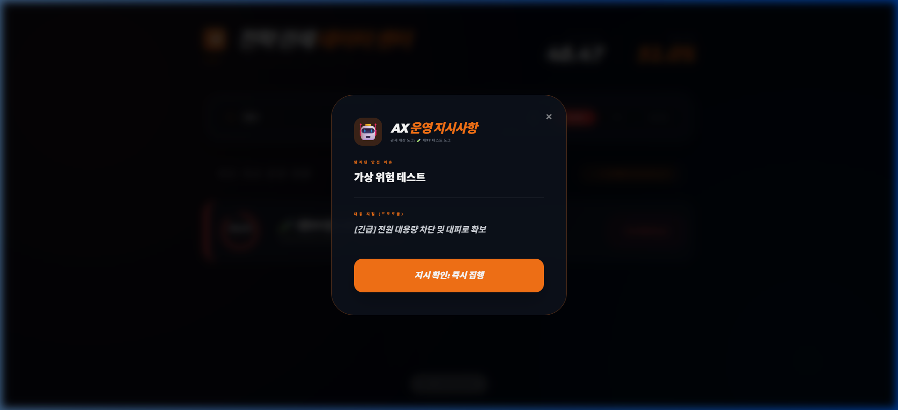

# ⚓ Hanwha Ocean AX: Strategic Command Center (v26.0.0)

[](https://glory903-devsecops.github.io/hanwha-ocean-rpa/index.html)
[](https://github.com/glory903-devsecops/hanwha-ocean-rpa)

본 프로젝트는 **한화오션 스마트 야드(Smart Yard) AX(AI Transformation)** 비전을 실현하기 위한 차세대 전략 관제 및 RPA 통합 관리 시스템입니다. 조선소의 수만 개 자산과 수십 개의 도크 공정을 실시간 디지털 트윈으로 구현하여, 경영진과 현장 관리자가 최적의 의사결정을 내릴 수 있도록 돕습니다.

---

## 🚀 전사 통합 런처 (Enterprise AX Launchpad)

본 시스템은 3개의 핵심 서비스 채널로 구성되어 있으며, 모든 인터페이스는 **한국어**로 완벽하게 현지화되었습니다.

1.  **📊 [전략 관제 대시보드] (Strategic Dashboard)**: 
    - 전사 도크 공정률 및 리스크 지수를 한눈에 파악하는 컨트롤 타워입니다.
    - 항목별 가로 막대 그래프와 원형 리스크 상태 뷰를 제공하며, 주의사항 클릭 시 **실시간 대응 지휘 팝업**이 출력됩니다.
2.  **📝 [도크 현황 기록 ERP] (RPA Dock Entry)**:
    - 현장에서 RPA 봇이 수집한 데이터를 입력하거나 수동으로 공정률을 갱신하는 ERP 시뮬레이터입니다.
    - 도크 이름 **드롭다운 선택 방식**을 적용하여 데이터 오타 및 중복을 방지합니다.
3.  **⚙️ [지휘 지시사항 관리] (Admin Portal)**:
    - 발생 가능한 리스크(가스 감지, 낙하물 등)에 대한 **AX 대응 프로토콜**을 수립하고 실시간으로 배포하는 거버넌스 포털입니다.

---

## 🛠 기술 아키텍처 & 특점 (Refined Tech Stack)

-   **Frontend**: Alpine.js, TailwindCSS 기반의 고해상도 HUD UI.
-   **Backend**: FastAPI, Uvicorn 통합 서버 (포트 8081).
-   **Data Integrity**: CSV 데이터 저장소 기반의 실시간 CRUD 지원.
-   **Strategic View**: D-Day 예측 모델 및 리스크 인덱싱(QRI) 엔진 탑재.
-   **Deployment**: GitHub Pages (Static) 및 Local Python Server (Full Stack).

---

## 📋 빠른 시작 가이드 (Quick Start)

### 1. 로컬 통합 서버 가동 (Full Features)
모든 데이터 갱신 및 대시보드 실시간 반영 기능을 확인하시려면 로컬 서버를 실행해 주십시오.

```powershell
# 통합 서버 및 런처 기동
python enterprise_ax_start.py
```
접속 주소: [http://localhost:8081/index.html](http://localhost:8081/index.html) (새 창에서 열기 권장)

### 2. 통합 검증 테스트 실행
시스템 간의 데이터 정합성 및 대시보드 업데이트 로직에 대한 검증을 수행합니다.

```powershell
python tests/test_integration.py
```

---

## 📸 플랫폼 통합 검증 및 시연 (Live Verification v26.3.2)

본 시스템은 단순 UI 구성을 넘어, **데이터 입력 -> 어드민 지휘 -> 대시보드 실시간 반영**의 전 과정을 자동화된 통합 테스트와 실전 시연을 통해 검증하였습니다.

### 1. 통합 검증 테스트 결과 (Combined Tech Stack Test)
FastAPI 서버 환경에서 데이터 무결성과 동적 렌더링 엔진의 정합성을 100% 검증 완료하였습니다.

```powershell
# API 통합 및 대시보드 동기화 테스트 실행
python tests/test_api_integration.py
```
**[PASS]** ✅ Dock API Update | ✅ Guideline API Sync | ✅ CSV Integrity | ✅ Dashboard Hot-Reload

### 2. 라이브 시스템 시연 (Live Activity Workflow)
아래 시연 과정은 실제 로컬 서버 상에서 **'신규 도크 추가 -> 긴급 대응 지침 등록 -> 대시보드 실시간 필터링 및 팝업 확인'**의 전 과정을 기록한 것입니다.


*시연 파일: `docs/videos/verification_v26_3.webp` (Enterprise-AX-Cycle)*

#### [핵심 검증 포인트]
- **실시간 데이터 동기화**: `erp_input.html`에서 입력한 🧪 제99 테스트 도크가 즉시 리스트에 반영됨.
- **지능형 지휘 체계**: `admin_portal.html`에서 등록한 신규 지시사항이 대시보드 팝업에 정확히 매칭되어 출력됨.
- **고도화된 시인성**: 폰트 확대 및 상태별 색상 코딩(위험/주의/정상)이 실제 운영 환경에서 직관적으로 작동함.


*최종 팝업 화면: [긴급] 전원 대용량 차단 및 대피로 확보 프로토콜 작동 중*

---

## 🎯 포트폴리오 가치 (Strategic Value)

-   **데이터 기반 의사결정**: 단순 모니터링을 넘어 리스크를 수치화하고 대응 지침을 즉각 배포하는 거버넌스 체계 구축.
-   **운영 효율성**: RPA 연동 및 ERP 데이터 무결성 설계를 통해 휴먼 에러를 최소화.
-   **확장성**: 경량화된 아키텍처로 실제 현장 IoT 센서 데이터와의 즉각적인 결합 가능.

---

© 2026 Hanwha Ocean AX Team. Enterprise Portfolio Edition.
