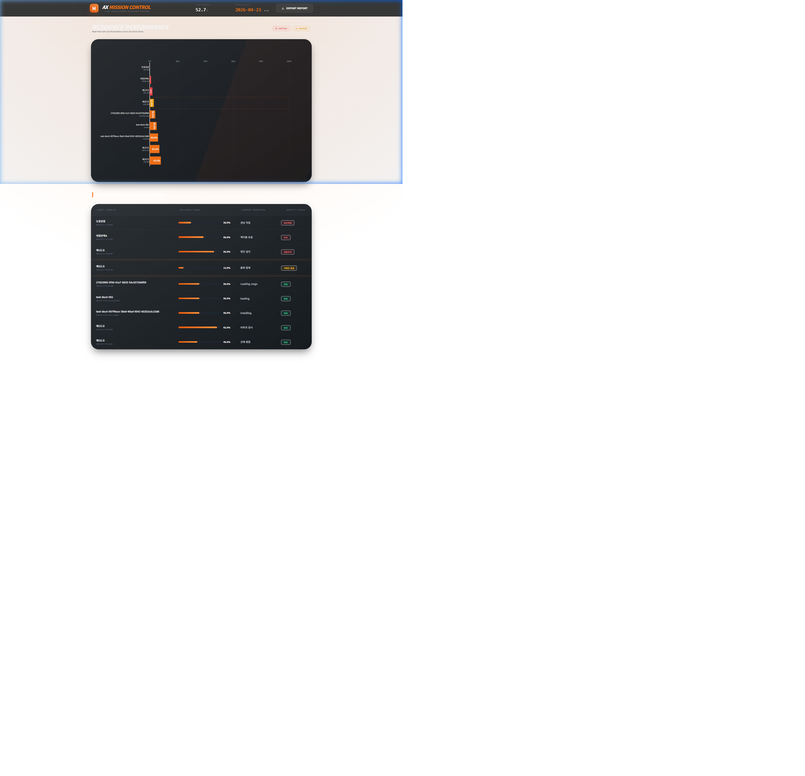
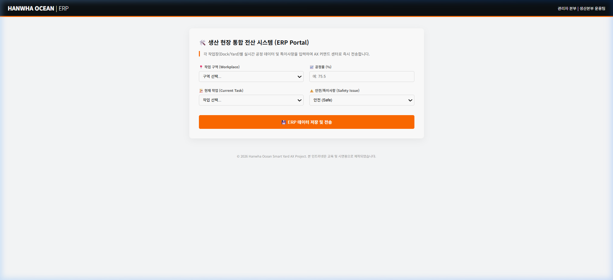

# 한화오션 Smart Yard RPA 공정 최적화 시스템

한화오션 야드 내 공정 자동화 현황을 실시간으로 분석하고 AI 최적화 알고리즘을 통해 공기를 단축하는 RPA 커맨드 센터입니다.

## ✨ 주요 특징
- **프리미엄 UI/UX**: 다크 테마 및 글래스모피즘이 적용된 고해상도 공정 현황판
- **AI 공정 분석**: 데이터 기반의 공정 지연 위험 요소 자동 감지 및 리소스 재배치 권장
- **실시간 모니터링**: 도크별 진척도 및 예상 완공일(D-Day) 실시간 대시보드

## 🔗 Live Deployment (실시간 웹 서비스)
> **[한화오션 AX 커맨드 센터 바로가기](https://glory903-devsecops.github.io/hanwha-ocean-rpa/)**
*(자산 모니터링 시스템(8000번)과 분리되어 **8081번 포트**에서 독립적으로 운영됩니다.)*

## 🚀 Core Value Proposition (핵심 가치)
본 프로젝트는 **'데이터가 보이는 야드, 예측 가능한 조업'**을 목표로 합니다.

1.  **실시간 가시성 (Visibility)**: 거제/통영 등 광범위한 야드의 산재된 데이터를 통합하여 휴먼 에러 없는 객관적인 지표를 실시간으로 제공합니다.
2.  **선제적 리스크 관리 (Proactive AX)**: AI의 완공일 예측을 통해 조업 지연을 사전에 감지하고, 인력 재배치 등 구체적인 조치 사항(Guidance)을 제시하여 생산을 최적화합니다.
3.  **디지털 거버넌스 (Governance)**: RPA-AI-BI로 이어지는 자동화 파이프라인을 통해 전사적 데이터 신뢰도를 확보하고 보고 시간을 획기적으로 단축합니다.

---

## 📸 Dashboard Preview (Mission Control Edition v13.1.0)


*브랜드 정체성이 강화된 오렌지 포인트 컬러와 'Vertical Stack' 레이아웃이 적용된 한화오션 전용 AX 미션 컨트롤 대시보드입니다.*

### [3-Stage Automation Journey]
````carousel

<!-- slide -->

<!-- slide -->

````

---

## 🤖 AX Automation Workflow (Integrated Pipeline)

본 프로젝트는 **RPA를 통한 데이터 자동 수집부터 AI 분석, 시각화, 보고서 생성**까지의 전 과정을 자동화합니다.

| 단계 | 내 용 | 핵심 기술 |
| :--- | :--- | :--- |
| **Stage 1** | **ERP 소스 포털** | `mock_portal.html` 기반의 조업 시뮬레이션 데이터 생성 |
| **Stage 2** | **RPA 데이터 정형화** | Selenium 봇을 통한 비정형 데이터 수집 및 `dock_status.csv` DB화 |
| **Stage 3** | **AI 커맨드 센터** | **v13.0 Premium Engine**을 통한 실시간 공정 분석 및 시각화 |
| **Stage 4** | **자동 보고서 추출** | 데이터 유효성을 검증한 클라이언트 사이드 CSV 리포트 생성 (`UTF-8-SIG`) |

---

## ✅ Reliability & Verification (신뢰성 검증)

본 시스템은 **TestSprite**를 통한 엔터프라이즈급 자동화 테스트를 통과하였습니다.

- **Frontend Health (TC004)**: `PASSED` - Tailwind CSS 리액티브 레이아웃 및 HTML 자동 렌더링 검증 완료.
- **Backend Stability (POST/GET)**: `PASSED` - 다중 작업(Multi-task) 데이터 무결성 및 CSV 실시간 업데이트 확인.
- **Data Integrity**: `utf-8-sig` 인코딩 적용으로 엑셀(Excel) 한글 깨짐 현상 100% 해결.

---

## 🏗️ Modular Enterprise Architecture

프로젝트의 지속 가능한 유지보수와 AI 확장을 위해 **클린 아키텍처**를 채택하였습니다.

- **Centralized Config**: 모든 경로 및 CI 브랜드 컬러 관리 (`src/core/config.py`).
- **Decoupled Logic**: 공정률 및 D-Day 연산 로직을 시각화 레이어와 완전 분리 (`src/core/analytics.py`).
- **Interactive Visualization**: Plotly 기반의 고해상도 그래픽 엔진 (`src/viz/dashboard.py`).

---

## 🧭 Project Blueprint (Strategy & Documentation)

1.  **[AX 전략 및 로드맵](docs/AX_STRATEGY.md)**: 사업 비전 및 단계별 고도화 전략.
2.  **[데이터 명세 및 수식 사전](docs/DATA_DICTIONARY.md)**: 공정률/D-Day 산출 공식(Formula) 기술서.
3.  **[시스템 설계서(SDD)](docs/SDD.md)**: ETL 흐름도 및 Mermaid 아키텍처 다이어그램.
4.  **[운영 가이드](docs/USER_MANUAL.md)**: 상세 실행 방법 및 Trouble-shooting.

---

## 🚀 실행 가이드 (Quick Start)

```bash
# 1. 저장소 폴더로 이동
cd hanwha-ocean-rpa

# 2. 파이프라인 엔진 실행 (데이터 생성 및 분석)
python src/main.py

# 3. 웹/API 서버 동시 실행
python run_server.py
```

### 🔗 접속 링크 (Local Access)
- **가상 ERP 포털**: [http://localhost:8081/src/mock_portal.html](http://localhost:8081/src/mock_portal.html)
- **AI AX 대시보드**: [http://localhost:8081/smart_yard_dashboard.html](http://localhost:8081/smart_yard_dashboard.html)
- **API 서버 (Swagger)**: [http://localhost:8082/docs](http://localhost:8082/docs)

---
*Developed by Hanwha Ocean AX High-End Portfolio Project.*

---
*Developed by Hanwha Ocean AX High-End Portfolio Project.*
