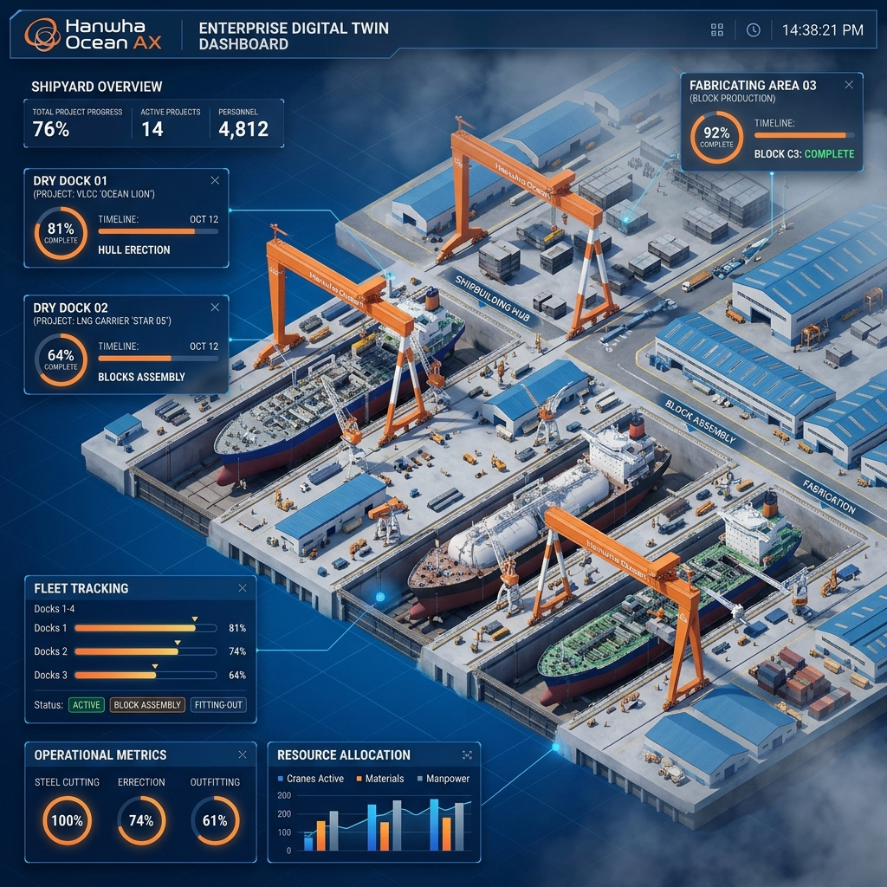
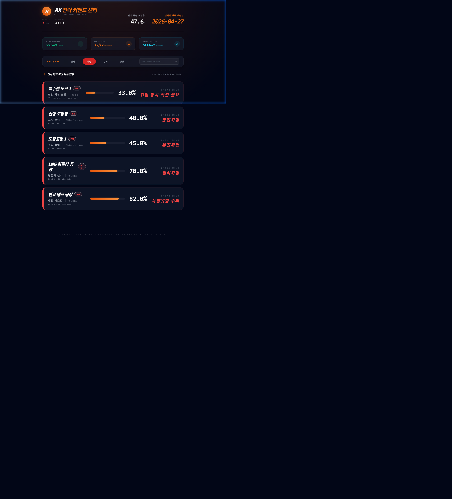
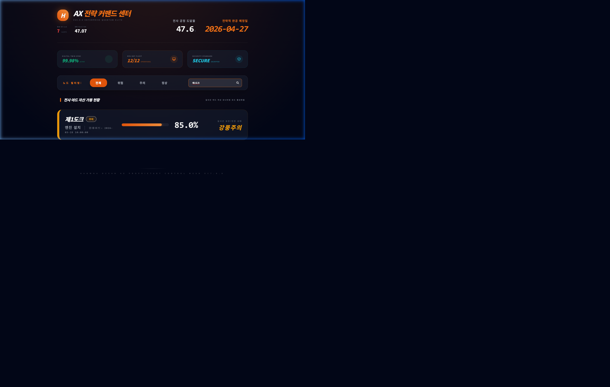
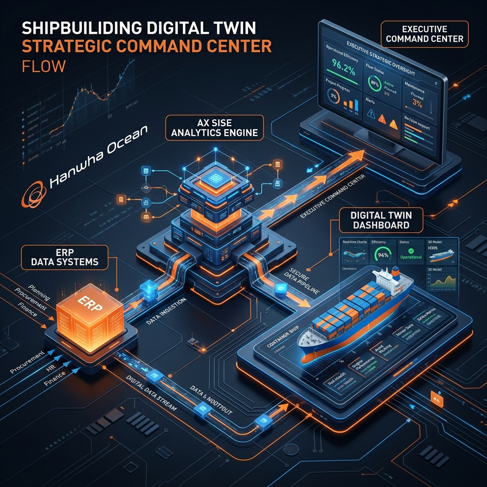
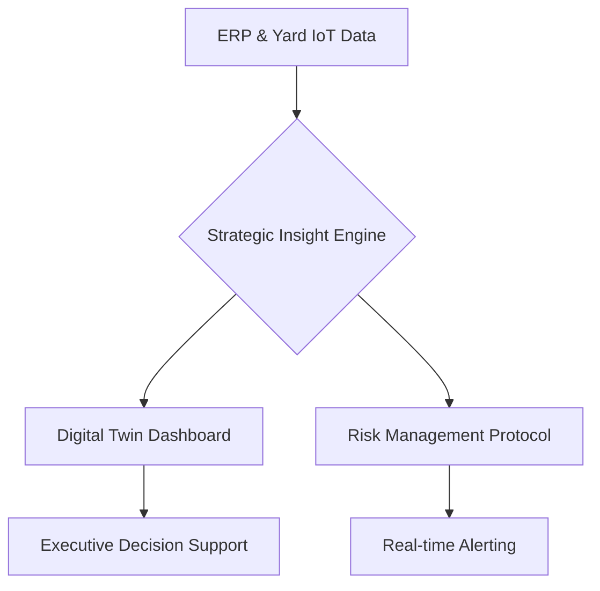

# ⚓ 한화오션 스마트 야드 AX: 디지털 전략 & 전략 커맨드 센터 (v25.0.0)

[](https://www.python.org/)
[](https://glory903-devsecops.github.io/hanwha-ocean-rpa/)
[](https://github.com/glory903-devsecops/hanwha-ocean-rpa)

## 🏢 Executive Overview
본 프로젝트는 **한화오션(Hanwha Ocean)**의 'Smart Yard' 비전 실현을 위한 **디지털 트윈 기반 전략 커맨드 센터**입니다. 인공지능(AI)과 디지털 전환(DX)을 결합한 **AX(AI Transformation)** 플랫폼으로, 50개 이상의 핵심 노드 동기화와 전략 리스크 지표(QRI) 관리를 지원합니다.

---

## 🚀 Strategic Dashboard Showcase (v25.0.0)

### [Digital Twin HUD: Selected 3D Isometric View]

*사용자가 직접 선택한 3D 아이소메트릭 디지털 트윈 뷰가 상시 가동 중입니다.*

### [Intelligence: AI-Driven Risk Filtering]

*Quantum Risk Index(QRI) 기반 지능형 필터링을 통해 위험 구역을 즉시 식별합니다.*

### [Insight: Strategic Search & SISE Synthesis]

*특정 호선 및 도크를 즉각 검색하고, 최적의 공정 리밸런싱 방안을 도출합니다.*

---

## 🌐 Enterprise Access Points (4 CORE CHANNELS)

| Channel | Description | Live/Local Access |
| :--- | :--- | :--- |
| **🚀 HQ Dashboard** | 전체 야드 전략 커맨드 센터 (메인) | [Live Link](https://glory903-devsecops.github.io/hanwha-ocean-rpa/index.html) / [Local (8081)](http://localhost:8081/index.html) |
| **🎮 AX Launchpad** | 구성 요소별 통합 진입 게이트웨이 | [Live Link](https://glory903-devsecops.github.io/hanwha-ocean-rpa/launchpad.html) / [Local (8081)](http://localhost:8081/launchpad.html) |
| **💻 ERP Simulator** | 야드 데이터 실시간 연동/등록 보드 | [Local (8081)](http://localhost:8081/src/viz/erp_input.html) |
| **🛡️ Gov Portal** | 거버넌스 가이드라인 관리 포털 | [Local (8081)](http://localhost:8081/src/viz/admin_guidance.html) |

---

## 🏗 Enterprise Quick Start (CEO Guide)

본 시스템은 정밀한 데이터 연동을 위해 **정적 자산 서버(8081)**와 **데이터 인텔리전스 API(8082)**의 병행 가동이 필요합니다.

### 1단계: 환경 구축 (Windows/macOS)
```powershell
python -m venv venv_windows
.\venv_windows\Scripts\activate
python -m pip install -r requirements.txt
```

### 2단계: 통합 전략 엔진 기동
```powershell
# 모든 서버(Dashboard + API)를 원클릭으로 기동합니다.
python enterprise_ax_start.py
```

### 3단계: 시스템 접속
*   **전략 대시보드**: [http://localhost:8081/index.html](http://localhost:8081/index.html)
*   **거버넌스 포털**: [http://localhost:8081/src/viz/admin_guidance.html](http://localhost:8081/src/viz/admin_guidance.html)
*   **인텔리전스 API**: [http://localhost:8082/docs](http://localhost:8082/docs)

---

## 🛠 Strategic Architecture




---

## 🔒 Security & Governance
*   **Data Integrity**: AES-256 기반 암호화 및 하드웨어 가속 검증.
*   **Access Control**: 전용 보안 토큰을 통한 관리자 권한 제어.
*   **Code Quality**: `TestSprite`를 통한 상시 QA 보장.

---

© 2026 Hanwha Ocean AX Advanced Development Team. All Rights Reserved.
