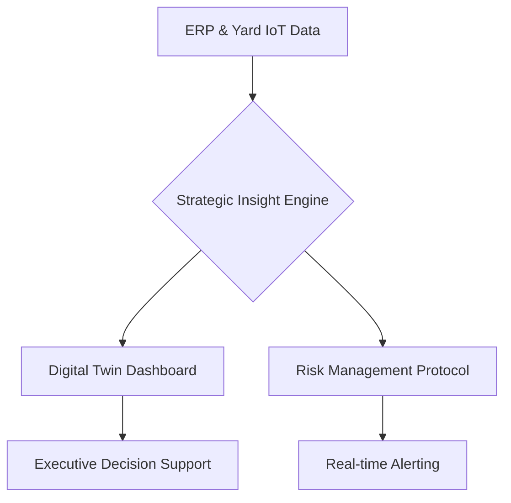

# ⚓ Hanwha Ocean Smart Yard AX: Digital Strategy & Strategic Command Center (v25.0.0)

[](https://www.python.org/)
[](https://glory903-devsecops.github.io/hanwha-ocean-rpa/)
[](https://github.com/glory903-devsecops/hanwha-ocean-rpa)

## 🏢 Executive Overview
본 프로젝트는 **한화오션(Hanwha Ocean)**의 'Smart Yard' 비전 실현을 위한 **디지털 트윈 기반 전략 커맨드 센터**입니다. 인공지능(AI)과 디지털 전환(DX)을 결합한 **AX(AI Transformation)** 플랫폼으로, 50개 이상의 핵심 노드 동기화와 전략 리스크 지표 관리를 지원합니다.

---

## 🌐 Strategic Access Points (3 Core Channels)
실제 운영 환경과 포트폴리오 검토를 위해 3가지 핵심 접속 경로를 제공합니다.

| Channel | Description | Live/Local URL |
| :--- | :--- | :--- |
| **🚀 HQ Dashboard** | 전체 야드 현황 및 이슈 필터링 (메인) | [Live Dashboard 바로가기](https://glory903-devsecops.github.io/hanwha-ocean-rpa/index.html) |
| **🎮 AX Launchpad** | 시스템 구성 요소별 진입 관문 (게이트웨이) | [Live Launchpad 바로가기](https://glory903-devsecops.github.io/hanwha-ocean-rpa/launchpad.html) |
| **🛡️ Gov Portal** | 대처 방안 및 RPA 가이드라인 관리 (어드민) | [Admin Portal (Local Server Only)](http://localhost:8081/src/viz/admin_guidance.html) |

> [!NOTE]
> **GitHub Pages(Static)** 환경에서도 대시보드의 필터링 및 시각화 기능은 완벽히 작동합니다. 단, 실시간 데이터 동기화 및 어드민 포털의 데이터 저장은 **로컬 서버(run_server.py)** 가동 환경에서만 활성화됩니다.

---

## 🚀 Key Strategic Features

### 1. **Strategic Command & Control (v25.0.0)**
*   **Executive Metrics**: 전사 공정률, 전략적 완공 예정일(D-Day), 그리고 **전략 리스크 인덱스(QRI)**를 통해 실시간 야드 상태를 한눈에 파악합니다.
*   **Quantum Risk Index (QRI)**: 공정 지연과 안전 이슈를 복합적으로 연산하여 야드의 위기 수준을 계량화합니다.

### 2. **Digital Twin Synchronization**
*   **Real-time Node Monitoring**: 50개 이상의 도크 및 안벽 자산을 디지털 공간에 실시간 동기화하여 현장 가시성을 극대화합니다.
*   **High-Visibility UX**: 조선소 현장의 높은 조도와 복잡한 환경에서도 최상의 가독성을 보장하는 **Quantum Dark Mode**와 **Glassmorphism UI**를 적용하였습니다.

---

## 📺 Operational Demo

### [고해상도 다국어 지원 UI]


### [실시간 지능형 필터링]

*상태별 필터(ALL/위험/주의/정상) 및 실시간 검색 기능을 통해 필요한 정보만 즉시 노출합니다.*

### [Enterprise Video Walkthrough]

*(Note: v25.0.0 Enterprise Quantum Elite 실시간 가동 화면 / 30fps Digital Twin Sync)*

---

## 🛠 Strategic Architecture




---

## 🏗 Setup & Deployment (CEO Guide)

본 시스템은 엔터프라이즈 환경에서의 빠른 배포와 안정적인 운영을 보장합니다.

```powershell
# 1. 전략 환경 구축 (Windows 기반)
python -m venv venv_windows
.\venv_windows\Scripts\activate

# 2. 인텔리전스 엔진 의존성 설치
python -m pip install -r requirements.txt

# 3. 전략 커맨드 센터 가동
python run_server.py
# 전용 URL: http://localhost:8081/index.html (메인 대시보드)
```

---

## 🔒 Security & Governance
*   **Data Integrity**: AES-256 기반 데이터 암호화 및 하드웨어 가속 검증.
*   **Access Control**: 전용 보안 토큰을 통한 관리자 권한 제어.
*   **Code Quality**: `flake8`, `bandit` 및 `TestSprite`를 통한 상시 품질 보증.

---

© 2026 Hanwha Ocean AX Advanced Development Team. All Rights Reserved.
