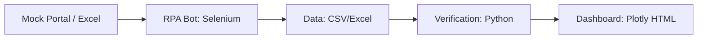

# [SDD] System Design Document: AX Automation Pipeline

## 1. 시스템 아키텍처 개요
본 시스템은 **Data Source -> Extraction (RPA) -> Analytics -> Visualization**의 4단계 파이프라인으로 구성됩니다.

## 2. 모듈별 상세 설계 (Module Design)

### 2.1 Data Extraction (RPA)
- **모듈**: `src/rpa_bot.py`, `src/mock_portal.html`
- **기술**: Selenium (Headless Mode)
- **기능**: 웹 기반 포털에서 공정 데이터를 스크래핑하여 `data/` 폴더에 구조화된 형식으로 저장.

### 2.2 Data Analytics & Simulation
- **모듈**: `src/generate_pbi_data.py`
- **기술**: Pandas, NumPy
- **기능**: 도크별 공정률 및 안전 교육 이수 데이터를 시뮬레이션하고 예측 로직(Linear Projection) 적용.

### 2.3 Verification Layer
- **모듈**: `tests/test_pbi_ready.py`
- **기능**: 시각화 및 BI 툴 연동 전 데이터의 무결성(컬럼명, 데이터 타입 등)을 체크.

### 2.4 Visualization (Dashboard)
- **모듈**: `src/auto_dashboard.py`
- **기술**: Plotly Graph Objects, Subplots
- **디자인**: Hanwha Orange 테마 기반의 Dark UI. 브라우저 독립 실행 가능 (Standalone HTML).

## 3. 데이터 명세 (Data Specification)
- **dock_status.csv**: 도크명, 공정률(%), 현재 작업명, 안전 이슈 코드.
- **safety_training_master.xlsx**: 작업자명, 소속 팀, 이수 여부, 교육 일자.
